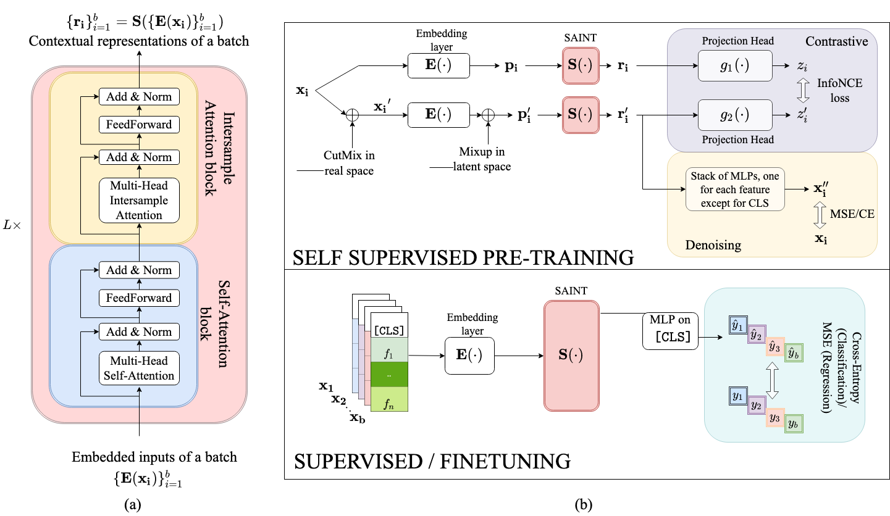

This repository is the official PyTorch implementation of SAINT. Find the paper on [arxiv](https://arxiv.org/abs/2106.01342) 

# SAINT: Improved Neural Networks for Tabular Data via Row Attention and Contrastive Pre-Training





## Requirements

We recommend using `anaconda` or `miniconda` for python. Our code has been tested with `python=3.8` on linux.

Create a conda environment from the yml file and activate it.
```
conda env create -f saint_environment.yml
conda activate saint_env
```

Make sure the following requirements are met

* torch>=1.8.1
* torchvision>=0.9.1

### Optional
We used wandb to update our logs. But it is optional.
```
conda install -c conda-forge wandb 
```


## Training & Evaluation

In each of our experiments, we use a single Nvidia GeForce RTX 2080Ti GPU.


To train the model(s) in the paper, run this command:

```
python train.py --dset_id <openml_dataset_id> --task <task_name> --attentiontype <attention_type> 
```

Pretraining is useful when there are few training data samples. Sample code looks like this. (Use train_robust.py file for pretraining and robustness experiments)
```
python train_robust.py --dset_id <openml_dataset_id> --task <task_name> --attentiontype <attention_type>  --pretrain --pt_tasks <pretraining_task_touse> --pt_aug <augmentations_on_data_touse> --ssl_samples <Number_of_labeled_samples>
```


### Arguments
* `--dset_id` : Dataset id from OpenML. Works with all the datasets mentioned in the paper. Works with all OpenML datasets.
* `--task` : The task we want to perform. Pick from 'regression','multiclass', or 'binary'.
* `--attentiontype` : Variant of SAINT. 'col' refers to SAINT-s variant, 'row' is SAINT-i, and 'colrow' refers to SAINT.
* `--embedding_size` : Size of the feature embeddings
* `--transformer_depth` : Depth of the model. Number of stages.
* `--attention_heads` : Number of attention heads in each Attention layer.
* `--cont_embeddings` : Style of embedding continuous data.
* `--pretrain` : To enable pretraining
* `--pt_tasks` : Losses we want to use for pretraining. Multiple arguments can be passed.
* `--pt_aug` : Types of data augmentations used in pretraining. Multiple arguments are allowed. We support only mixup and CutMix right now.
* `--ssl_samples` : Number of labeled samples used in semi-supervised experiments. 
* `--pt_projhead_style` : Projection head style used in contrastive pipeline.
* `--nce_temp` : Temperature used in contrastive loss function.
* `--active_log` : To update the logs onto wandb. This is optional

#### <span style="color:Tomato">Most of the hyperparameters are hardcoded in train.py file. For datasets with really high number of features, we suggest using smaller batchsize, lower embedding dimension and fewer number of heads.</span>

### Evaluation

We choose the best model by evaluating the model on validation dataset. The AuROC(for binary classification datasets), Accuracy (for multiclass classification datasets), and RMSE (for regression datasets) of the best model on test datasets is printed after training is completed. If wandb is enabled, they are logged to 'test_auroc_bestep', 'test_accuracy_bestep', 'test_rmse_bestep'  variables.


## What's new in this version?
* Regression and multiclass classification models are added.
* Data can be accessed directly from openml just by calling the id of the dataset.


## Acknowledgements

We would like to thank the following public repo from which we borrowed various utilites.
- https://github.com/lucidrains/tab-transformer-pytorch

## License
This repository is released under the Apache 2.0 license as found in the [LICENSE](LICENSE) file.

## Cite us

```
@article{somepalli2021saint,
  title={SAINT: Improved Neural Networks for Tabular Data via Row Attention and Contrastive Pre-Training},
  author={Somepalli, Gowthami and Goldblum, Micah and Schwarzschild, Avi and Bruss, C Bayan and Goldstein, Tom},
  journal={arXiv preprint arXiv:2106.01342},
  year={2021}
}

```
